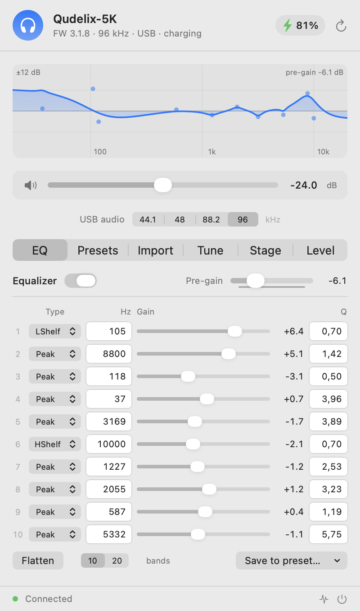
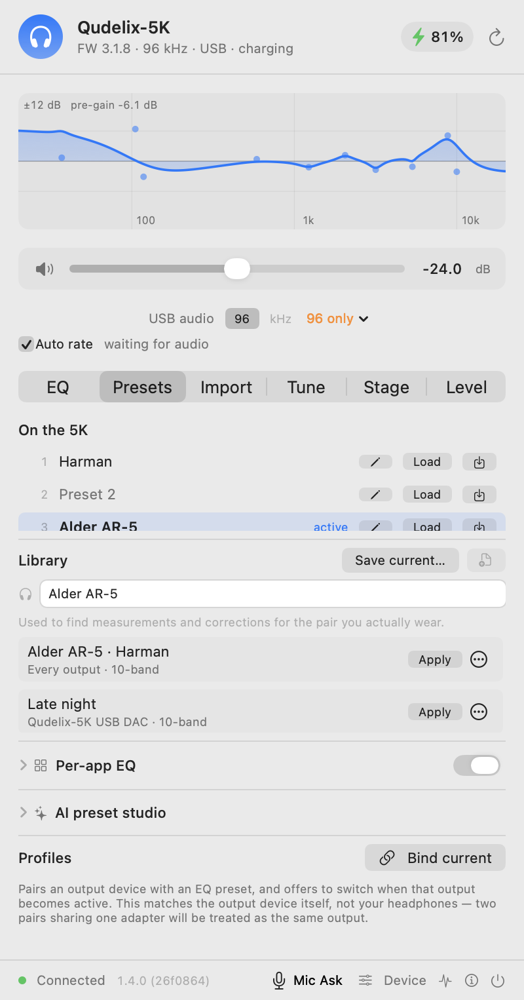
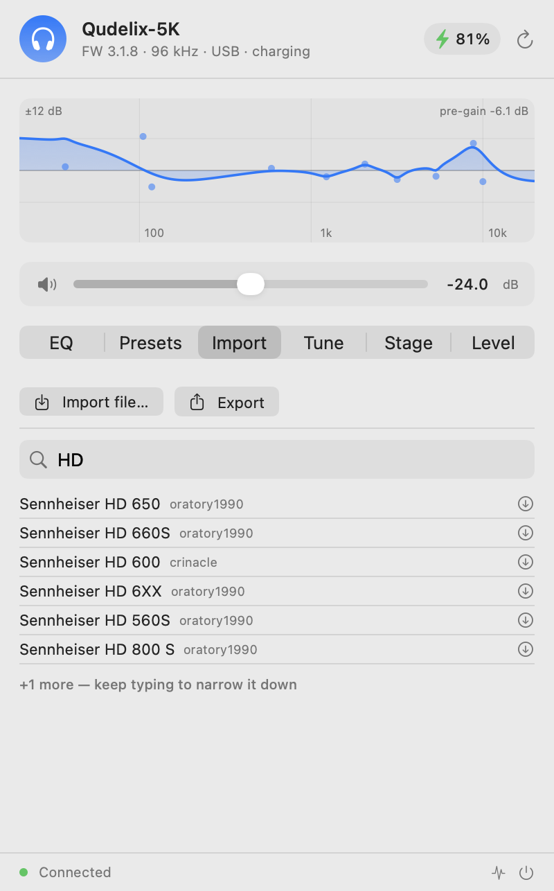
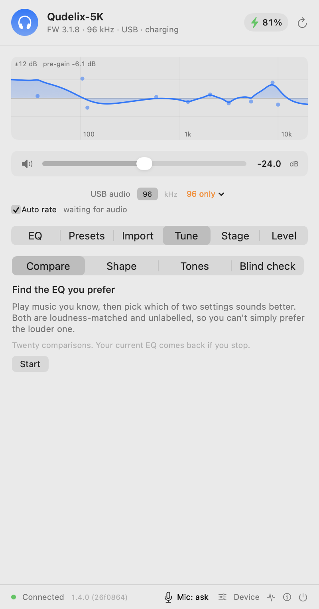
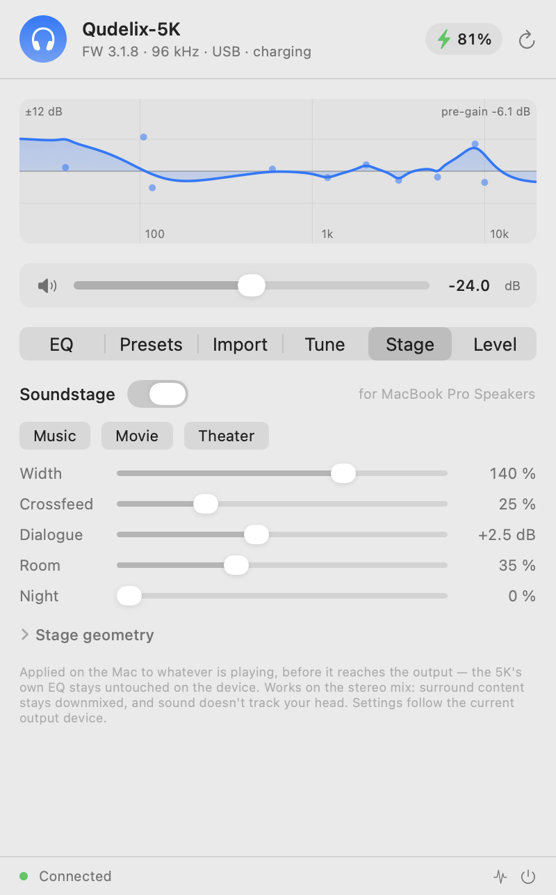
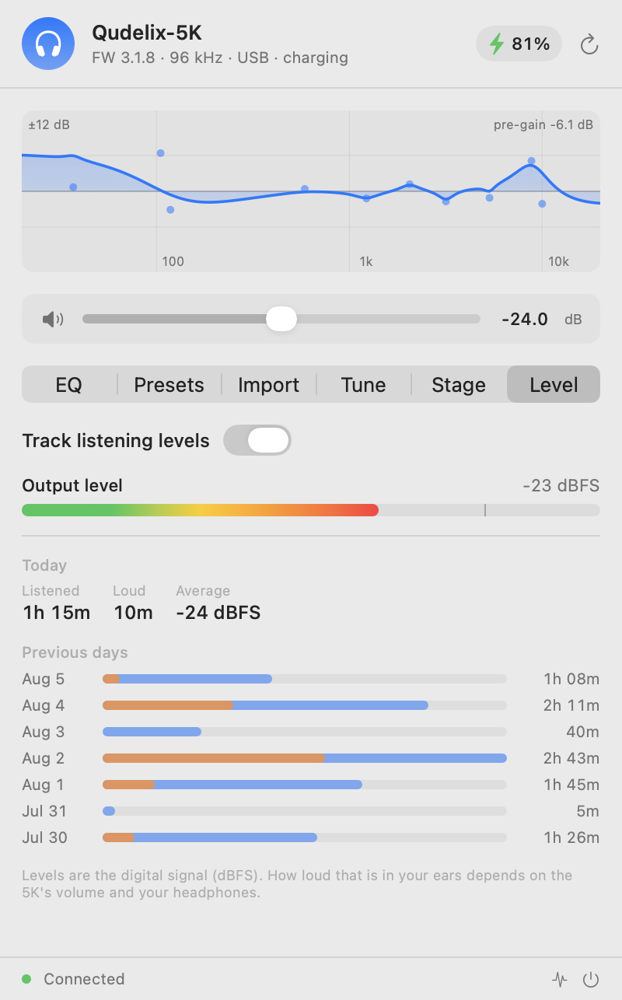

# Qudelix for macOS

A native macOS menu bar app for configuring the **Qudelix 5K** DAC/amp, over USB
or Bluetooth.

[](https://github.com/FrankieMa77/qudelix/releases/latest)
[](https://github.com/FrankieMa77/qudelix/releases)
[](https://github.com/FrankieMa77/qudelix/releases/latest)
[](https://github.com/FrankieMa77/qudelix/releases/latest)
[](LICENSE)

Unofficial, and not affiliated with or endorsed by Qudelix, Inc.

Qudelix ship a browser-based configuration app. On macOS it is unreliable —
Chrome's WebHID goes through the same system call that, if a report is framed
even one byte wrong, makes the 5K stop responding and drop off the USB bus. This
app talks to the device directly through IOKit instead, and gets the framing
right.

---

## Screenshots

| Equalizer | Presets | Import |
|---|---|---|
|  |  |  |

| Tune | Stage | Level |
|---|---|---|
|  |  |  |

## Features

- **Live device status** — battery, charging, firmware, sample rate, input source
- **Battery in the menu bar** — a bolt while charging, the level once it runs
  low, and notifications at 20% and 10% (see below)
- **Volume** control with mute
- **Sample rate** — set the rate macOS runs the 5K at, change which rates the
  device offers, or let the app match the rate to what you're playing (see below)
- **10-band parametric EQ** editor: filter type, frequency, gain, Q, plus pre-gain
- **20-band mode** — switch between 10 and 20 bands from the EQ pane; the app
  also follows a switch made anywhere else
- **Live response curve** showing the combined filter shape
- **20 preset slots**, loaded and saved by name
- **Preset import** from a file, or from the
  [AutoEq](https://github.com/jaakkopasanen/AutoEq) database (6,000+ headphones)
- **Export** your EQ in the standard parametric format
- **Tune** — find the EQ you actually prefer, by ear (see below)
- **Stage** — a soundstage for headphones: width, crossfeed, dialogue lift and
  room, applied on the Mac (see below)
- **Level** — live output level and a 14-day listening history
- **Stream quality detection** — measures whether what's playing looks lossy
  or lossless (any player: it doesn't ask apps, it analyzes the audio), and
  can auto-match the USB rate: lossless → 44.1 kHz bit-perfect, lossy → your
  chosen rate. Both parts can be switched off
- **Diagnostics panel** logging every packet exchanged with the device

Works over **USB or Bluetooth**. USB is used whenever the 5K is plugged in;
otherwise the app controls the device over Bluetooth LE. Either way it only
speaks to the 5K's control interface and never touches the audio path, so
playback is unaffected. The one exception is opt-in: while the **Stage** is
switched on, the Mac's audio is processed on its way to the output device
(the 5K's own EQ still runs on the device, untouched).

## Install

Download the `.dmg` from [Releases](../../releases), drag the app to
Applications, and launch it.

macOS will refuse to open it the first time — the app is signed only ad-hoc, not
with a paid Apple Developer ID. To allow it, open **System Settings → Privacy &
Security**, scroll to Security, and click **Open Anyway**. (The old
right-click → Open trick no longer works on current macOS.)

If you would rather not trust a binary, build it yourself — see below.

Requires macOS 14 or later. Universal binary, Apple Silicon and Intel.

### Verify your download

Because the app is signed ad-hoc, macOS cannot tell you who built it, and the
"Open Anyway" click above is pure trust. The checksum published with every
release is what narrows that gap. Before opening the DMG:

```
shasum -a 256 ~/Downloads/Qudelix-1.2.0.dmg
```

Compare the result against the SHA-256 in the [latest release
notes](../../releases/latest). Or, if you also downloaded the `.dmg.sha256`
file, let `shasum` do the comparison:

```
cd ~/Downloads && shasum -a 256 -c Qudelix-1.2.0.dmg.sha256
```

That should print `OK`. If the hashes differ, or the check fails, do not open
the file.

Be clear about what this does and does not buy you: it catches a corrupted
download or an asset replaced after publication, and it lets you confirm two
people downloaded the same bytes. It is not a substitute for notarization, and
it assumes the release page you read the hash from is itself genuine. Building
from source sidesteps all of it.

## Supported devices

The original **Qudelix 5K** on firmware 3.x, in either 10-band or 20-band EQ
mode.

The app identifies the device during its connection handshake, and if it finds
something it does not implement it says so and writes nothing, rather than
silently doing the wrong thing:

| Case | Why |
|---|---|
| 5K Plus, T71, Aura Vita | different EQ command set |
| Firmware 2.x | Qudelix changed the command format in firmware 3 |
| Firmware 1.x | too old; the official app refuses these too |

## Tune

EQ is personal, and reading a frequency-response graph tells you very little about
what you will enjoy. The **Tune** tab offers two ways to settle it by ear.


### Compare

Blind A/B. Play music you know well, and the app presents two EQ settings; you
pick whichever sounds better. It narrows down from there, over roughly twenty
comparisons, and ends with a curve you can keep or save to a preset.

1. Start playing music at a comfortable volume, and leave the volume alone.
2. Open **Tune → Compare → Start**.
3. Use **Switch** to flip between A and B as often as you like, then **Prefer A**
   or **Prefer B**. If they genuinely sound the same, say so — that answer is
   used, not discarded.
4. At the end, **Keep** the result or **Save to…** a preset slot. **Discard**
   restores exactly what you had.

Both options are always matched for loudness and never labelled, so you cannot
simply prefer the louder one — which is what happens in most casual A/B tests.
Some pairs are deliberately identical, as a check on how reliable the session was.

### Tones

Plays faint tones at ten frequencies and finds the quietest level you can hear at
each, then compares that with typical hearing.

1. Set a comfortable volume, and sit somewhere quiet.
2. Open **Tune → Tones → Start**.
3. Press **I hear it** (or the space bar) the moment you hear anything, however
   faint. Roughly one presentation in five is silent on purpose.
4. If the result shows a real difference across the range, **Apply** writes a
   correction. If it does not, the app says so and leaves your EQ alone.

Tones stay quiet throughout, and the EQ is switched off while measuring so the
measurement is of you and your headphones rather than of your EQ settings.

Two honest caveats. Without laboratory calibration this measures your ears and
your headphones together, so it is specific to that pairing and is **not** a
hearing test in any medical sense — if you are worried about your hearing, see an
audiologist. And for most people with ordinary hearing the answer is "nothing to
correct", which the app will tell you plainly rather than inventing a curve.

## Sample rate

macOS runs a USB DAC at **one fixed rate** and resamples everything else to it.
Unlike iOS it never switches that rate to match what you're playing, so a 5K
parked at 96 kHz plays every 44.1 kHz album through a resampler. The row under
the volume slider fixes that without a trip to Audio MIDI Setup.


**Pick a rate.** 44.1 / 48 / 88.2 / 96 kHz, applied instantly. Match it to what
you listen to — most music is 44.1 kHz, most video 48 kHz — and the system stops
resampling.

**Change what the 5K offers.** The device decides which rates it advertises to
the Mac, and it can be pinned to a single one; if yours is, macOS has nothing
else to offer and the picker will show only that rate. The label at the end of
the row says which rates the device is currently offering and changes it. The
5K restarts its USB connection to re-enumerate, so audio drops for a second or
two and the app reconnects on its own.

**Or let it follow the music.** With **Auto rate** ticked, the app measures
what's playing and matches the rate to it: lossless → 44.1 kHz, lossy → the rate
you last chose yourself, content that genuinely extends beyond the 44.1 family →
96 kHz. It only acts on a verdict that has held for ten seconds, leaves at least
45 seconds between changes, and never switches while the Soundstage is on
(that path resamples anyway). The row narrates every state in plain words —
"listening to what's playing…", "lossless — set 44.1 kHz automatically",
"lossy — keeping your rate" — so nothing happens silently. Untick it and the
rate stays exactly where you put it.

How the detection decides is described under [Level](#level); the short version
is that it measures the audio rather than asking the player, so it works with
Spotify, Apple Music, a local file or a browser tab alike.

## Battery

The 5K reports its charge over both USB and Bluetooth, and the app surfaces it
in three places so you don't have to open anything to know.

**In the menu bar.** A bolt appears next to the icon while charging. Once the
charge drops to 20% the icon is joined by the level itself, so a glance at the
corner of the screen is enough. Hovering shows charge, the active preset and
which link is carrying the connection.

**In the popover.** The header pill shows the percentage, orange at 20% and red
at 10%, with the state spelled out in the line underneath.

**As notifications.** Standard macOS notifications at 20% and 10%, and one when
charging starts. Each fires once per episode — they won't nag if the reading
hovers around a threshold, and they survive a brief Bluetooth dropout without
re-announcing the same low battery. macOS asks for notification permission the
first time one actually fires, not at launch.

## Stage

Headphones put the band inside your head. The **Stage** tab spreads it back
out: mid/side width with a brilliance shelf on the sides, an interaural
crossfeed (each ear hears a delayed, darkened copy of the other channel — the
cue that moves sound out of the skull), a mid-only dialogue lift, and sparse
early reflections with a short diffuse tail. Presets for **Music**, **Movie**
and **Theater**, plus geometry controls — Distance, Span, Center, Size — and a
**Night** mode that evens out movie dynamics without touching dialogue.


Unlike everything else in this app, the Stage runs on the Mac, not on the 5K:
it processes what the Mac plays on its way to the output device, using a
system audio tap (macOS asks once for the System Audio Recording permission;
macOS 14.2+). The 5K keeps doing its own EQ on-device, so nothing is applied
twice. Settings are kept per output device, and the whole pipeline exists only
while the Stage is switched on — off means off, with the app back to being a
pure remote control.

Honesty notes, because this feature category is full of overpromising: it
works on the stereo mix — it widens and rooms what is already there. Surround
content stays downmixed, nothing tracks your head, and mono content (most
YouTube speech) gives Width and Crossfeed nothing to work with — the pane
tells you when that is what's playing rather than letting you hunt for a
difference that cannot exist.

## Level

Live output level, time listened, and how much of it was loud — today and for
the previous week, kept 14 days. Useful for the "why are my ears tired"
conversation with yourself. Metering rides the Stage engine when it runs, or a
listen-only tap (nothing inserted into the audio path) when you switch **Track
listening levels** on by itself.

Levels are digital signal level (dBFS), not sound pressure: the app cannot
know your headphones' sensitivity or the 5K's analog volume, so it reports
trends and durations honestly instead of pretending to be a dosimeter. Nothing
is recorded and nothing leaves the Mac.

### Is this actually lossless?

The same pane can tell you whether what's playing came from a lossy or a
lossless source. It doesn't ask the player — no music app exposes that to other
apps — it measures the audio, which is why it works the same for Spotify, Apple
Music, a local file or a browser tab.

Lossy encoders discard the top of the spectrum, and where they stop is
characteristic: around 16 kHz at low bitrates, around 20 kHz at 320 kbps, while
lossless material carries energy to the edge of its sample rate. The verdict
appears in plain words with the frequency it measured, and it feeds the
automatic rate matching described under [Sample rate](#sample-rate).

It is evidence, not proof, and the wording says which:

- A lossless file made **from** a lossy source keeps the original's cutoff and
  is reported as lossy. That is the correct answer about the audio, even though
  the file is technically lossless.
- Warm or old masters roll off on their own before any codec would cut them.
  The app reports "rolls off naturally — can't judge" rather than accusing them,
  and casts no vote on the rate.
- Quiet or dark passages carry no treble to judge at all, and say so.

Switch it off entirely with the toggle if you'd rather not have the app
listening; with it and the Stage both off, nothing touches your audio.

## Build from source

```sh
git clone https://github.com/FrankieMa77/qudelix.git
cd qudelix/QudelixBar
./build-app.sh              # current architecture, fast
./build-app.sh --universal  # arm64 + x86_64
./make-dmg.sh               # universal build, packaged as a DMG
```

Swift 5.9+ and the Xcode command line tools are all that is required; there are
no third-party dependencies.

## Privacy

- The only host contacted is `raw.githubusercontent.com`, and only to fetch the
  AutoEq headphone list and the preset you choose. This happens when you open
  the Import pane, never at launch.
- No telemetry, analytics, or crash reporting, and nothing is ever uploaded.
- The Stage and Level features process audio in memory and write none of it
  anywhere, ever. What is persisted — per-device stage settings and the daily
  listening totals — lives in
  `~/Library/Application Support/QudelixBar/stage.json`, alongside a small
  `diag.txt` engine heartbeat for bug reports. Both are local files, readable
  only by your user account. Like the packet log, `diag.txt` records the
  names of your audio output devices, so give it the same glance before
  attaching it to a bug report.
- One local file is written, `~/Library/Logs/QudelixBar.log`, holding device
  packet traces. It is never transmitted. Since it records raw packet hex it
  includes the 5K's own Bluetooth address and any preset names stored on it, so
  it is worth a glance before attaching it to a bug report.
- Bluetooth scanning never records the names of other devices nearby, only a
  count of how many were ignored.
- Only EQ, volume, and preset settings are written to the device — the same
  things the official app writes. Firmware is never touched.

## Developer tools

`Sources/qxusb` and `Sources/qxprobe` are diagnostic CLIs, not part of the app.
They can destabilise a device if misused — `qxusb --noid` deliberately
reproduces a USB bus-drop failure, and `qxprobe` sends Bluetooth GAIA commands.
Read the source before running them.

## Known limitations

- Only the user (headphone) EQ group is exposed, not the speaker group.
- Preset slots show generic names unless you have named them on the device.
- Only firmware 3.x is supported; see the table above for what happens on
  anything else.
- No auto-update mechanism yet.

## Feedback and contributions

Bug reports, ideas, and pull requests are all welcome — open an
[issue](../../issues) or a PR.

Especially useful right now:

- **Firmware other than 3.1.8**, or any 5K that behaves oddly — the diagnostics
  panel and `~/Library/Logs/QudelixBar.log` capture everything needed.
- **Intel Macs.** The binary is universal but has only been run on Apple Silicon.

## Licence

[MIT](LICENSE). Use it, build it, fork it; no warranty is given.

## Credits

- [devicePEQ](https://github.com/jeromeof/devicePEQ) — prior open-source work on
  the Qudelix HID protocol
- [AutoEq](https://github.com/jaakkopasanen/AutoEq) by Jaakko Pasanen — the
  headphone correction database
